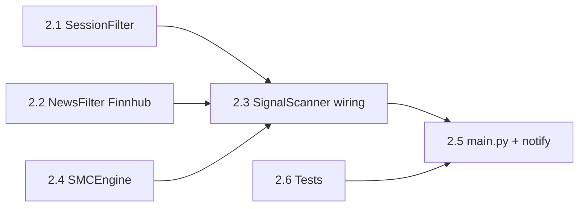

# Kế hoạch chi tiết: Phase 2 — Strategy Core

## 1. Mục tiêu và phạm vi

| Hạng mục | Nội dung |
|----------|----------|
| **Mục tiêu** | Pipeline đầy đủ: OHLCV (MT5/Mock) → SMC → lọc phiên → lọc tin → `Signal` hợp lệ; log và/hoặc Telegram **chỉ thông báo tín hiệu** (không gửi lệnh MT5). |
| **Ngoài phạm vi** | `RiskManager` sizing thực thi, `OrderManager`, mở/đóng lệnh, partial TP — thuộc **Phase 3**. |
| **Quyết địch đã khóa** | FTMO account có sẵn; Finnhub + `FINNHUB_API_KEY`; Phase 2 không execution. |

## 2. Trạng thái codebase (điểm neo)

- `src/data/models.py`: đã có `Signal`, enums (`SignalType`, `Direction`, …) — **không tạo file `signal_types.py` trùng**; chỉ bổ sung field/helper nếu thiếu sau khi SMC phát sinh nhu cầu.
- `config/settings.yaml`: `sessions` (UTC), `strategy.*`, `pairs[]` — đủ để đọc timeframe theo symbol.
- `src/main.py`: vòng lặp có TODO Phase 2/3 — Phase 2 sẽ chèn **bước quét tín hiệu** sau bước daily reset/guardian, **không** gọi `order_send`.
- `requirements.txt`: đã có `smartmoneyconcepts`, `aiohttp` — thêm dependency chỉ khi thiếu (ví dụ không cần thêm nếu chỉ dùng `aiohttp` cho Finnhub).

## 3. Thứ tự triển khai (bắt buộc)

Thứ tự phụ thuộc: session/news không phụ thuộc SMC; SMC phụ thuộc dataframe; scanner phụ thuộc cả ba.



### 2.1 — `SessionFilter` (`src/strategy/session_filter.py`)

- **Input:** `settings["sessions"]` (đã có london/new_york/asian UTC); thời điểm hiện tại UTC (hoặc inject `datetime` để test).
- **API đề xuất:**
  - `is_trading_session(now: datetime) -> tuple[bool, str]` — `str` = tên phiên hoặc `"off_session"`.
  - `auto_trade_allowed(now: datetime) -> bool` — theo `auto_trade` từng khối; **overlap London–NY** = union khoảng `new_york` ∩ `london` hoặc đánh dấu `overlap` trong config (nếu chưa có key `overlap`, tính giao **trong code** để tránh sửa YAML nhiều).
  - `session_quality(now) -> float` — overlap ≈ 1.0, london/ny ≈ 0.8, asian ≈ 0.3 (hằng số theo brainstorm).
- **Acceptance:** Unit test với bảng thời điểm cố định (table-driven): ví dụ 12:45 UTC = NY, 08:00 UTC = london, 03:00 UTC = off hoặc asian.

### 2.2 — `NewsFilter` (`src/strategy/news_filter.py`)

- **Nguồn:** Finnhub — REST async (`aiohttp`), token `os.getenv("FINNHUB_API_KEY")`.
- **Endpoint:** dùng đúng [Finnhub Economic Calendar](https://finnhub.io/docs/api/economic-calendar) (hoặc endpoint calendar hiện hành trong docs); tham số `from`/`to` = ngày hiện tại (UTC) ± 1 ngày nếu cần.
- **Cache:** tránh gọi API mỗi 15s; cache trong RAM với TTL (ví dụ 30–60 phút) hoặc theo `settings`.
- **Logic:**
  - Parse impact (high / chỉ định critical bằng keyword trong `event` hoặc danh sách symbol/country).
  - `is_news_blocked(now, symbol) -> tuple[bool, str]` — map USD news → XAUUSD, EURUSD, … theo `implementation_plan` (currency → pairs).
  - Khoảng cấm: mặc định ±15 phút high; ±30 phút cho FOMC/NFP/CPI (cấu hình hóa trong `settings.yaml` mục `news:`).
- **Acceptance:** Test đơn vị với JSON fixture (không gọi mạng); một test tích hợng tùy chọn (skip nếu không có key).

### 2.3 — Cấu hình `news:` trong `config/settings.yaml`

Thêm khối ví dụ:

```yaml
news:
  provider: finnhub
  cache_ttl_minutes: 45
  block_before_high_minutes: 15
  block_after_high_minutes: 15
  block_before_critical_minutes: 30
  block_after_critical_minutes: 30
  critical_keywords: ["FOMC", "NFP", "CPI", "Fed"]
```

Loader: đọc trong `NewsFilter.__init__(settings)` hoặc factory từ `main`.

### 2.4 — `SMCEngine` (`src/strategy/smc_engine.py`)

- **Input:** `symbol: str`, `data: dict[str, pd.DataFrame]` keys `H4`, `H1`, `M15` (đúng `pairs[].timeframes` trong settings).
- **Output:** `list[Signal]` — mỗi phần tử là `src.data.models.Signal`; set `id` (uuid4), `expiry` từ `strategy.signal_expiry_minutes`, `created_at` UTC.
- **Logic:** bọc `smartmoneyconcepts` theo hướng dẫn thư viện: swing highs/lows → BOS/CHoCH → OB / FVG / liquidity tùy phiên bản API; ghép bias H4 + structure H1 + entry M15 như `implementation_plan.md`.
- **Giới hạn:** nếu thư viện trả cấu trúc khác tên API, adapter 1 file; không fork nhiều nhánh đặc thù per-pair trừ khi cần (YAGNI).
- **Acceptance:** Test với dataframe OHLCV tổng hợp cố định (CSV trong `tests/fixtures/`) — assert ít nhất: engine chạy không lỗi, số signal ≥ 0, field bắt buộc của `Signal` hợp lệ.

### 2.5 — `SignalScanner` (`src/strategy/scanner.py` hoặc `signal_scanner.py`)

- **Chức năng:** Với mỗi `pair` enabled: `get_rates` từ `mt5_client` / mock theo đúng timeframe; gọi `SMCEngine.analyze`; áp `SessionFilter` và `NewsFilter`; loại signal khi blocked.
- **Rate:** tái sử dụng `scan_interval_seconds`; không nhân đôi gọi Finnhub (dùng cache ở NewsFilter).
- **Acceptance:** Mock MT5 trả dataframe cố định; scanner trả list rỗng hoặc có phần tử sau khi filter.

### 2.6 — Tích hợp `main.py` (Phase 2)

- Sau bước daily reset / trước sleep: nếu `system.auto_mode` hoặc flag `signal_notify_only` (có thể dùng luôn `telegram.enabled` + không execute):
  - Gọi scanner.
  - Với mỗi signal mới (dedupe theo `symbol+direction+round(entry,5)` trong cửa sổ thời gian ngắn hoặc theo DB `signals` nếu đã có bảng — kiểm tra `db.py` có insert signal chưa).
- **Telegram:** method kiểu `notify_signal(signal, reason="scan")` — text ngắn, không nút mở lệnh.
- **Không** gọi `FTMOGuardian.can_open_trade` cho mở lệnh (có thể log dry-run optional Phase 3 — bỏ qua nếu gây nhầm).

### 2.7 — Database (tùy chọn nhưng nên có)

- Nếu `db.py` chưa có bảng/DAO cho `signals`: thêm migration nhẹ để lưu signal đã phát (tránh spam Telegram cùng một setup). Nếu đã có — chỉ wire từ scanner.

## 4. Kiểm thử

| Lớp | File / mục tiêu |
|-----|-----------------|
| Unit | `tests/test_session_filter.py` |
| Unit | `tests/test_news_filter.py` (fixture Finnhub) |
| Unit | `tests/test_smc_engine.py` (fixture OHLCV) |
| Unit | `tests/test_scanner.py` (mock MT5 + mock news) |
| Regression | `pytest tests/test_ftmo_guardian.py` (không phá vỡ) |

Coverage mục tiêu: SMC/session/news **không bắt buộc 100%** như Guardian; ưu tiên nhánh filter và parser.

## 5. Rủi ro và giảm thiểu

| Rủi ro | Cách xử lý |
|--------|------------|
| Finnhub tier/rate limit | Cache TTL dài; một request/ngày cho calendar day. |
| SMC quá nhiều tín hiệu | Giới hạn `max_signals_per_scan_per_symbol` trong settings (optional). |
| `smartmoneyconcepts` API đổi | Cô lập trong `smc_engine.py`; test fixture cố định. |

## 6. Định nghĩa xong Phase 2 (DoD)

- [x] Chạy trên Mac với `MT5Mock`: log hoặc Telegram hiển thị tín hiệu sau filter khi có điều kiện (có thể bật scenario test).
- [x] `pytest` toàn bộ tests mới + Guardian pass.
- [x] `task.md` cập nhật checklist Phase 2.
- [x] Không có `order_send` / `positions_open` từ luồng Phase 2.

## 7. Bước sau (Phase 3 — chỉ tham chiếu)

`RiskManager` → `OrderManager` → `FTMOGuardian.can_open_trade` trước mỗi lệnh → mở rộng Telegram — theo `implementation_plan.md` mục Phase 3.

## 8. Checklist công việc (hydrated)

- [x] **T2.1** Implement `session_filter.py` + tests
- [x] **T2.2** Thêm `news:` vào `settings.yaml`
- [x] **T2.3** Implement `news_filter.py` (Finnhub + cache) + tests fixture
- [x] **T2.4** Implement `smc_engine.py` + fixture CSV + tests
- [x] **T2.5** Implement `scanner.py` + tests mock MT5
- [x] **T2.6** Wire `main.py` (scan + notify only); optional DB dedupe
- [x] **T2.7** Cập nhật `task.md` / `docs/project-roadmap.md`
- [x] **T2.8** Chạy full `pytest`; sửa lỗi import/lint
